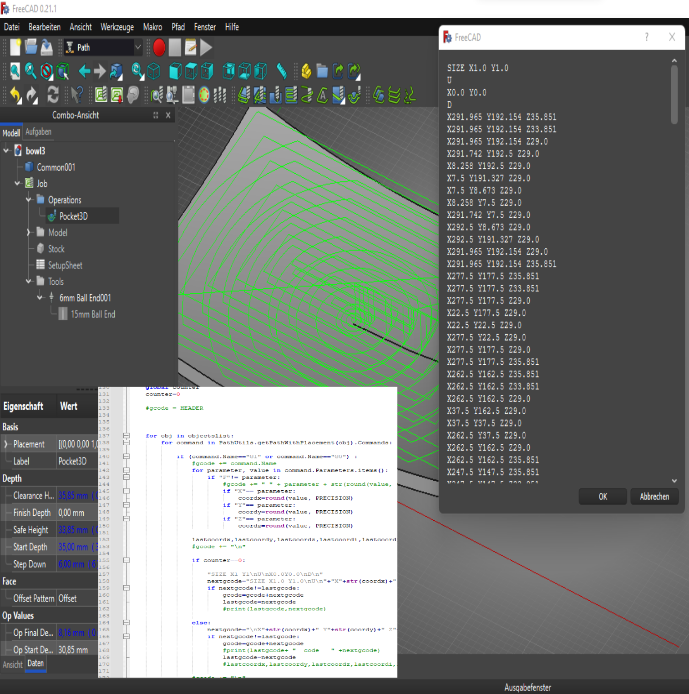

[www.CADialog.com](https://www.CADialog.com)


 
 
 


# About the Project
This FreeCAD workbench offers the possibilty to create simple cupboards and woodworkings for boards. It uses the full paramtric of FreeCAD and is able to generate cnc-programs for WEEKE/HOMAG machines (WoodWOP).
Also seperate postprocessors for WoodWop are available.



# Getting Started

# Installation

Manual installation
The install path for FreeCAD modules depends on the operating system used.

To find where is the user's application data directory enter next command on FreeCAD's Python console.

```python
App.getUserAppDataDir()
```
Examples on different OS

Linux: /home/user/.local/share/FreeCAD/Mod/

macOS: /Users/user/Library/Preferences/FreeCAD/Mod/

Windows: C:\Users\user\AppData\Roaming\FreeCAD\Mod\

# Getting Started
After Installation You can use the buttons of the workbench


# Roadmap

# Licence

Distributed under the Unlicense License. See `LICENSE.md` for more information.

# Contact

[www.CADialog.com](https://www.CADialog.com)

[info@cadialog.com](mailto:info@cadialog.com)
